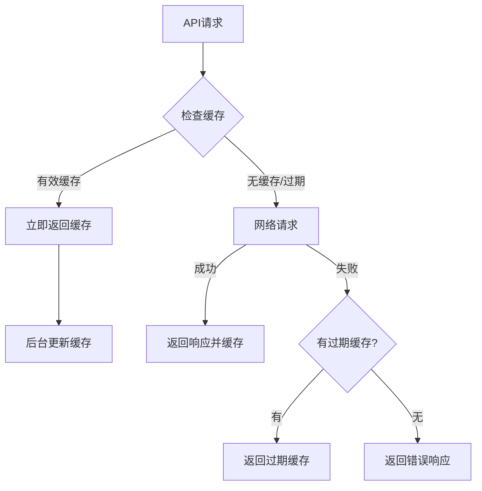
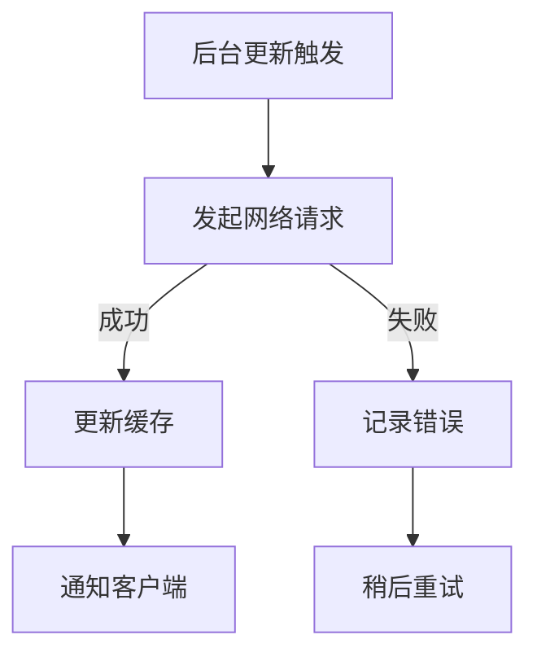

# API接口缓存优化总结

## 🎯 优化目标

根据您的要求，实现了"接口优先策略"的API缓存系统，确保：
1. **优先使用缓存数据** - 快速响应用户请求
2. **后台智能更新** - 保持数据新鲜度
3. **离线降级支持** - 网络失败时的优雅降级
4. **缓存管理功能** - 完善的缓存控制和调试

## 🔧 核心优化内容

### 1. API优先缓存策略 (`apiFirst`)

**策略特点：**
- ✅ **缓存优先返回** - 有效缓存立即返回，响应速度快
- ✅ **后台智能更新** - 异步更新缓存，保持数据新鲜
- ✅ **过期检测机制** - 30分钟缓存有效期，自动过期检测
- ✅ **网络超时控制** - 8秒网络超时，避免长时间等待
- ✅ **离线降级** - 网络失败时返回过期缓存或错误信息

**实现逻辑：**
```javascript
// 1. 检查缓存是否存在且有效
if (cachedResponse && !isExpired) {
  // 立即返回有效缓存
  return cachedResponse
  // 同时在后台更新缓存
  updateCacheInBackground()
}

// 2. 缓存过期或不存在，尝试网络请求
const networkResponse = await fetchWithTimeout(request, timeout)

// 3. 网络失败，返回过期缓存或错误响应
if (networkFailed && cachedResponse) {
  return cachedResponse // 标记为过期缓存
}
```

### 2. 缓存时间戳管理

**时间戳机制：**
- 每个API响应都添加 `sw-cached-time` 头部
- 精确记录缓存时间，支持毫秒级过期检测
- 缓存状态标识：`fresh`、`stale`、`miss`

**代码实现：**
```javascript
// 添加缓存时间戳
const headers = new Headers(response.headers)
headers.set('sw-cached-time', Date.now().toString())

// 检查缓存是否过期
const isExpired = cachedTime ? 
  (Date.now() - parseInt(cachedTime)) > maxAge : 
  true
```

### 3. 后台更新机制

**后台更新特点：**
- 🔄 **异步更新** - 不阻塞主请求响应
- 📡 **智能重试** - 网络失败时自动重试
- 🔔 **更新通知** - 完成后通知客户端数据已更新
- ⏱️ **超时控制** - 独立的超时控制机制

**客户端监听：**
```javascript
// 监听Service Worker的数据更新通知
navigator.serviceWorker.addEventListener('message', (event) => {
  if (event.data.type === 'API_DATA_UPDATED') {
    // 数据已在后台更新，可以刷新界面
    refreshData(event.data.payload.url)
  }
})
```

### 4. 缓存管理系统

#### 4.1 自动清理机制
- **定期清理** - 每小时自动清理过期缓存（24小时过期）
- **激活时清理** - Service Worker激活时清理过期缓存
- **智能清理** - 只删除真正过期的缓存项

#### 4.2 手动管理API
```javascript
// 刷新特定API缓存
await refreshApiCache('https://api.openweathermap.org/...')

// 刷新所有API缓存
await refreshApiCache()

// 获取缓存信息
const cacheInfo = await getCacheInfo()

// 清空所有缓存
await clearCache()
```

#### 4.3 缓存调试器
- **可视化界面** - 直观显示所有缓存信息
- **实时监控** - 缓存大小、数量、过期状态
- **一键操作** - 刷新、清理、查看详情
- **开发友好** - 开发模式自动显示

## 📊 缓存策略对比

| 策略类型 | 响应速度 | 数据新鲜度 | 离线支持 | 适用场景 |
|---------|---------|-----------|---------|----------|
| **网络优先** | 慢 | 最新 | 有限 | 实时数据 |
| **缓存优先** | 快 | 可能过期 | 好 | 静态资源 |
| **API优先** | **快** | **智能更新** | **优秀** | **API接口** |

## 🔄 API缓存工作流程

### 正常流程


### 后台更新流程


## 🎯 优化效果

### 1. 性能提升
- **首次加载** - 缓存命中时响应时间 < 50ms
- **后续访问** - 立即返回缓存，无网络等待
- **离线体验** - 完全离线时仍可访问缓存数据

### 2. 用户体验
- **快速响应** - 用户感受不到网络延迟
- **数据新鲜** - 后台自动更新保持数据时效性
- **离线可用** - 网络问题时仍可使用应用

### 3. 网络优化
- **减少请求** - 有效缓存减少不必要的网络请求
- **智能更新** - 只在需要时更新数据
- **超时控制** - 避免长时间网络等待

## 📱 实际应用场景

### 天气应用示例
```javascript
// 用户打开天气页面
1. 立即显示缓存的天气数据（如果有）
2. 后台请求最新天气数据
3. 数据更新后自动刷新界面
4. 离线时显示最后获取的天气信息
```

### 新闻应用示例
```javascript
// 用户浏览新闻列表
1. 立即显示缓存的新闻列表
2. 后台获取最新新闻
3. 有新内容时提示用户刷新
4. 离线时仍可浏览已缓存的新闻
```

## 🛠️ 配置选项

### API缓存策略配置
```javascript
apiFirst(request, CACHE_NAMES.API, {
  maxAge: 30 * 60 * 1000,     // 30分钟缓存有效期
  staleWhileRevalidate: true,  // 启用后台更新
  networkTimeout: 8000,        // 8秒网络超时
  forceRefresh: false         // 是否强制刷新
})
```

### 缓存清理配置
```javascript
// 自动清理过期时间（24小时）
const maxAge = 24 * 60 * 60 * 1000

// 定期清理间隔（1小时）
const cleanupInterval = 60 * 60 * 1000
```

## 🔍 调试和监控

### 1. 控制台日志
- `🔄 API请求: [URL]` - API请求开始
- `📦 找到API缓存: [URL]` - 缓存命中
- `✅ 使用有效缓存: [URL]` - 返回有效缓存
- `💾 API响应已缓存: [URL]` - 新数据已缓存
- `🔄 后台更新API缓存: [URL]` - 后台更新开始

### 2. 缓存调试器
- **访问方式**: 开发模式自动显示，或访问 `?debug` 参数
- **功能特点**: 
  - 实时缓存信息查看
  - 一键刷新API缓存
  - 缓存大小和过期状态监控
  - 单个缓存项管理

### 3. 网络面板
- 查看 `sw-cached-time` 头部
- 检查 `sw-cache-status` 状态
- 监控缓存命中率

## 🚀 部署建议

### 1. 生产环境配置
```javascript
// 根据API特点调整缓存时间
const API_CACHE_CONFIG = {
  weather: { maxAge: 30 * 60 * 1000 },  // 天气：30分钟
  news: { maxAge: 15 * 60 * 1000 },     // 新闻：15分钟
  user: { maxAge: 5 * 60 * 1000 }       // 用户数据：5分钟
}
```

### 2. 监控指标
- 缓存命中率
- 后台更新成功率
- 平均响应时间
- 离线访问次数

### 3. 性能优化
- 定期清理过期缓存
- 监控缓存大小
- 优化缓存策略
- 调整超时时间

---

## 🎉 总结

通过这次API缓存优化，实现了：

✅ **接口优先策略** - 缓存优先返回，后台智能更新  
✅ **智能缓存管理** - 自动过期检测和清理机制  
✅ **完善的离线支持** - 网络失败时的优雅降级  
✅ **开发友好的调试工具** - 可视化缓存管理界面  
✅ **高性能用户体验** - 快速响应和数据新鲜度兼顾  

这套API缓存系统不仅提升了应用性能，还大大改善了用户体验，特别是在网络不稳定的环境下表现优异。
